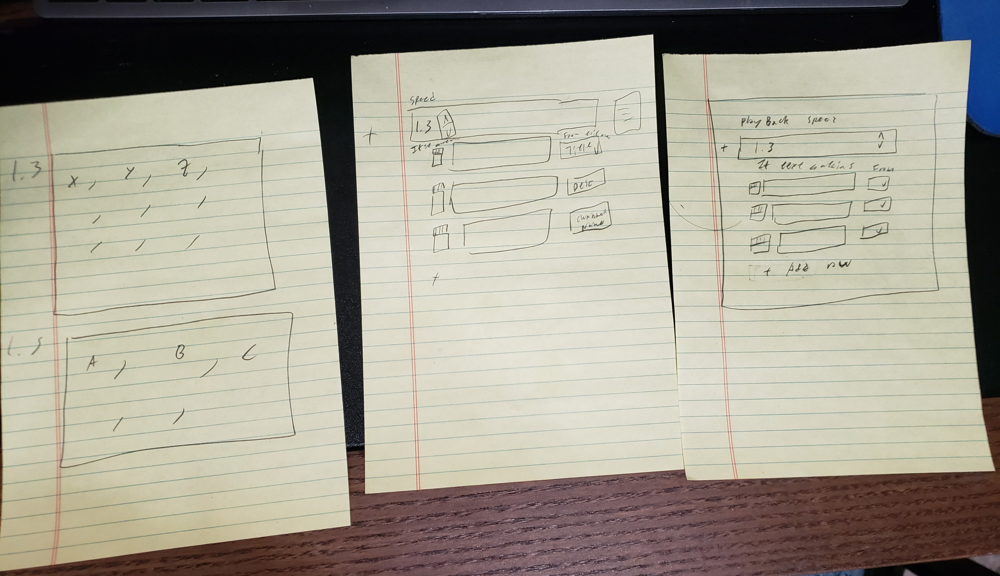

From left to right

1. So the first concept was a comma seperated list with a speed attached to it.
1. The second image replaced the comma seperated list with a table where each row contains a delete icon, input for text to match, and drop down menu to select (title, channel, or description)
1. The third image is the same but with more logical titles to intuition and understanding sake (although omitted I wish to also have arrows on the far right to change the order of time block, the idea that order will determine precidence for blocks setting time of videos)

The Final image on the right is an extremely rough mockup of what I wish the final design to look like